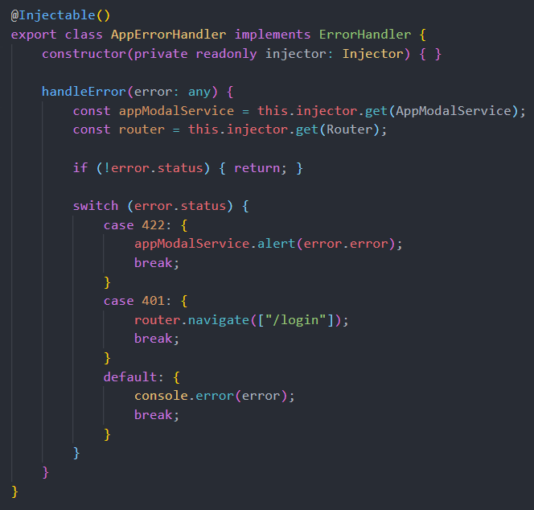

# DotNetCoreArchitecture

Architecture using new technologies and best practices to share knowledge and be used in new projects.

## Technologies

* [.NET Core 2.2](https://dotnet.microsoft.com/download)
* [C# 7.3](https://docs.microsoft.com/en-us/dotnet/csharp)
* [ASP.NET Core 2.2](https://docs.microsoft.com/en-us/aspnet/core)
* [Entity Framework Core 2.2](https://docs.microsoft.com/en-us/ef/core)
* [Angular 7.1](https://angular.io/docs)
* [Typescript 3.1](https://www.typescriptlang.org/docs/home.html)
* [HTML](https://www.w3schools.com/html)
* [CSS](https://www.w3schools.com/css)
* [SASS](https://sass-lang.com)
* [UIkit](https://getuikit.com/docs/introduction)
* [JWT](https://jwt.io)
* [Swagger](https://swagger.io)
* [Docker](https://docs.docker.com)

## Practices

* Clean Code
* Ubiquitous Language
* DDD (Domain-Driven Design)
* SOLID Principles
* KISS Principle (Keep it simple, stupid)
* DRY Principle (Don't repeat yourself)
* YAGNI Principle (You aren't gonna need it)
* Without Over-Engineering
* Inversion of Control
* Dependency Injection
* Object Mapping
* Logging
* Response Caching
* Response Compression
* Code Analysis
* Cross-Platform

## Nuget Packages

* Source: [https://github.com/rafaelfgx/DotNetCore](https://github.com/rafaelfgx/DotNetCore)
* Published: [https://www.nuget.org/profiles/rafaelfgx](https://www.nuget.org/profiles/rafaelfgx)

## Tools

* [Visual Studio 2017](https://visualstudio.microsoft.com/vs)
* [Visual Studio Code](https://code.visualstudio.com)
* [SQL Server 2017](https://www.microsoft.com/en-us/sql-server/sql-server-downloads)

## Layers

**Web:** This layer contains the api (ASP.NET Core) and the frontend (Angular).

**Application:** This layer is the main entry point of the application.

**Domain:** This layer contains the requirements and the business logic.

**Model:** This layer is responsible for modeling the domain objects.

**Database:** This layer isolates and abstracts the logic for data persistence.

**CrossCutting:** This layer provides generic features for other layers.

**IoC:** This layer provides inversion of control for other layers.

## Projects

## Microservices Example

## Application

## Domain

## Repository

## ASP.NET Core + Angular

## ASP.NET Core Startup

## ASP.NET Core Controller

## Angular Guard

## Angular Error Handler

## Angular HTTP Interceptor

## Angular Service

## Angular Component

## Performance

## Specifications

**Processor:** Intel Core I7 8700K Coffee Lake 8th-generation.

**Memory:** 16GB 2400Mhz DDR4.

**Storage:** Samsung Evo 960 SSD M2 250gb.

**OS:** Windows 10 Pro 64 bits.

**Web Server:** Kestrel.

**Database:** SQL Server 2017 Developer Edition.

## Swagger

## Run Command Line

1. Install latest [.NET Core SDK](https://aka.ms/dotnet-download).

2. Open directory **source\Web\Frontend** in command line and execute **npm run restore**.

3. Open directory **source\Web** in command line and execute **dotnet run**.

4. Open <https://localhost:8090>.

## Run Visual Studio Code

1. Install latest [.NET Core SDK](https://aka.ms/dotnet-download).

2. Install [C# Extension](https://marketplace.visualstudio.com/items?itemName=ms-vscode.csharp).

3. Open directory **source\Web\Frontend** in command line and execute **npm run restore**.

4. Open **source** directory in Visual Studio Code.

5. Press **F5**.

## Run Visual Studio 2017

1. Install latest [.NET Core SDK](https://aka.ms/dotnet-download).

2. Open directory **source\Web\Frontend** in command line and execute **npm run restore**.

3. Open **source\DotNetCoreArchitecture.sln** in Visual Studio.

4. Set **DotNetCoreArchitecture.Web** as startup project.

5. Press **F5**.

## Run Docker

1. Install and configure [Docker](https://www.docker.com/get-started).

2. Execute **docker-compose up --build -d --force-recreate** in root directory.

3. Open <http://localhost:8095>.

## Visual Studio Extensions

[CodeMaid](https://marketplace.visualstudio.com/items?itemName=SteveCadwallader.CodeMaid)

[Roslynator](https://marketplace.visualstudio.com/items?itemName=josefpihrt.Roslynator2017)

[SonarLint](https://marketplace.visualstudio.com/items?itemName=SonarSource.SonarLintforVisualStudio2017)

[TSLint](https://marketplace.visualstudio.com/items?itemName=vladeck.TSLint)
